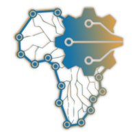

# AI4D-Africa-s-Anglophone-Research-Lab-Tanzania-Tourism-Classification

# Description
This challenge is open to users from English speaking African countries.

The Tanzanian tourism sector plays a significant role in the Tanzanian economy, contributing about 17% to the country’s GDP and 25% of all foreign exchange revenues. The sector, which provides direct employment for more than 600,000 people and up to 2 million people indirectly, generated approximately $2.4 billion in 2018 according to government statistics. Tanzania received a record 1.1 million international visitor arrivals in 2014, mostly from Europe, the US and Africa.

Tanzania is the only country in the world which has allocated more than 25% of its total area for wildlife, national parks, and protected areas.There are 16 national parks in Tanzania, 28 game reserves, 44 game-controlled areas, two marine parks and one conservation area.

Tanzania’s tourist attractions include the Serengeti plains, which hosts the largest terrestrial mammal migration in the world; the Ngorongoro Crater, the world’s largest intact volcanic caldera and home to the highest density of big game in Africa; Kilimanjaro, Africa’s highest mountain; and the Mafia Island marine park; among many others. The scenery, topography, rich culture and very friendly people provide for excellent cultural tourism, beach holidays, honeymooning, game hunting, historical and archaeological ventures – and certainly the best wildlife photography safaris in the world.

The objective of this hackathon is to develop a machine learning model that can classify the range of expenditures a tourist spends in Tanzania. The model can be used by different tour operators and the Tanzania Tourism Board to automatically help tourists across the world estimate their expenditure before visiting Tanzania.

# AI4D AFRICA’S ANGLOPHONE MULTIDISCIPLINARY RESEARCH LAB (http://ai4dlab.or.tz/)

The AI4D Africa’s Anglophone Multidisciplinary Research Lab is implemented under the collaboration of the University of Dodoma (UDOM) and Nelson Mandela African Institution of Science and Technology (NM-AIST). The lab is funded by an International Development Research Centre (IDRC) and Swedish International Development Cooperation Agency (Sida) through the AI4D Africa Program. The core functions of the lab include, to:

Support AI innovation, deployment and commercialization,
Support and conduct gender-inclusive and responsible AI research,
Strengthen research and teaching capacity of young researchers, and
Promote equitable distribution of AI high-quality teaching and learning materials.
Through innovation challenges, the lab seeks to promote inclusive AI research and innovation, and application of AI-based solutions in addressing pressing social challenges. The lab key focus is on four thematic areas that are Healthcare, Environmental Conservation and Agriculture, Digital Economy and Small-scale Industries, and Infrastructure and Data Ecosystem.

# About
The dataset describes 24,675 rows of up-to-date information on tourist expenditure collected by the National Bureau of Statistics (NBS) in Tanzania.The dataset was collected to gain a better understanding of the status of the tourism sector and provide an instrument that will enable sector growth.

Your goal is to accurately classify the range of expenditures a tourist spends in Tanzania.

The majority of the visitors under the age group of 25-44 came for business (18.5%), or leisure and holidays (53.2%), which is consistent with the fact that they are economically more productive. Those at the age group of 45-64 were more prominent in holiday making and visiting friends and relatives. The results further reveal that most visitors belonging to the age group of 18-24 came for leisure and holidays (55.3%) as well as volunteering (13.7%). The majority of senior citizens (65 and above) came for leisure and holidays (80.9%) and visiting friends and relatives (9.5%).

The survey covers seven departure points, namely: Julius Nyerere International Airport, Kilimanjaro International Airport, Abeid Amani Karume International Airport, and the Namanga, Tunduma, Mtukula and Manyovu border points.S
